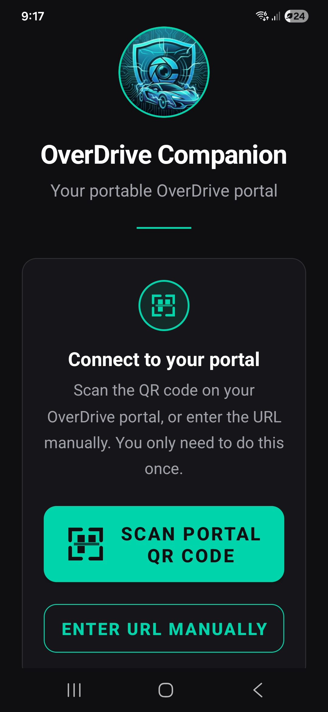
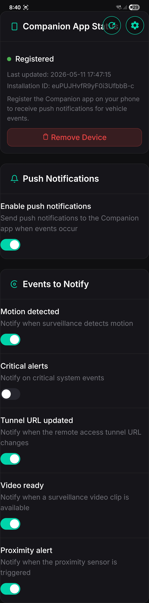
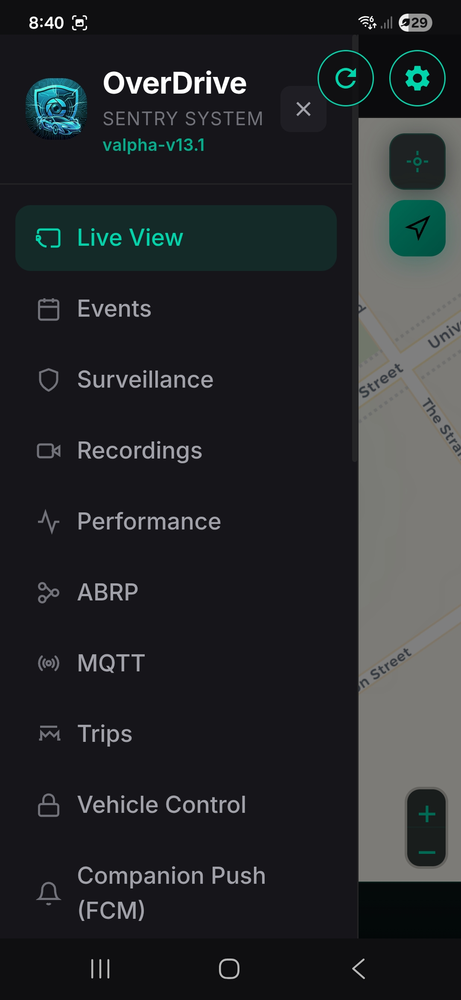
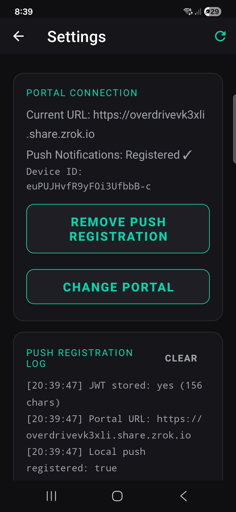
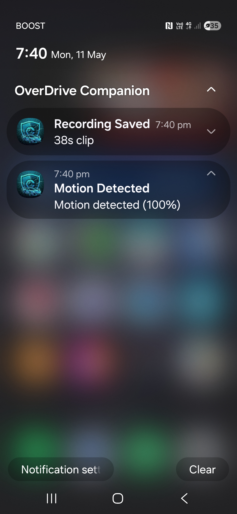

# OverDrive Companion

An Android companion app for the OverDrive portal. It provides a mobile interface to the portal via an embedded WebView, with support for push notifications and QR code / manual URL onboarding.

## Screenshots

| Welcome | Push Notifications Setting and status | App Menu | Settings | Notifications |
|:---:|:---:|:---:|:---:|:---:|
|  |  |  |  |  |

## Features

- **Portal WebView**: Loads your OverDrive portal URL in a full-screen WebView with back-navigation support
- **QR Code onboarding**: Scan the QR code displayed on the portal screen to connect instantly
- **Manual URL entry**: Type the portal URL directly if a QR code is not available
- **JWT auto-capture**: Automatically extracts the session JWT from the portal's WebView after login (used for authenticated API calls)
- **Refresh portal**: Floating refresh button on the main screen reloads the portal WebView
- **Settings blade**: Shows captured portal URL, push notification status, device installation ID, and registration log

> The following features require additional backend functionality to be implemented in the main OverDrive portal app:

- **Push notifications**: Register the device with the portal backend to receive FCM push notifications
- **Device identity**: Sends Firebase Installation ID alongside the FCM token so the backend can support multiple registered devices per user
- **Remove registration**: Deregister the current device from push notifications via the Settings screen
- **Refresh status**: Toolbar refresh button in Settings re-checks the server registration state; cached status is only updated on a successful HTTP 200 response

## Requirements

- Android 8.0 (API 26) or higher
- Google Play Services (required for Firebase Cloud Messaging / push notifications)
- An OverDrive portal instance with the following API endpoints:
  - `GET /api/fcm/status`: returns `{"registered": true|false}`
  - `POST /api/fcm/register`: accepts `{"token": "<fcm-token>", "installationId": "<firebase-installation-id>"}` with `Authorization: Bearer <jwt>`
  - `POST /api/fcm/clear`: removes the device registration; returns `{"status": "ok"}` with `Authorization: Bearer <jwt>`

## Installation

### Download the APK (no build required)

1. Go to the [Releases page](https://github.com/wbsoul/OverDriveCompanion/releases/latest)
2. Under **Assets**, tap or click `app-debug.apk` to download it
3. On your Android device:
   - Open **Settings → Apps → Special app access → Install unknown apps**
   - Allow your browser or file manager to install unknown apps
4. Open the downloaded APK file and tap **Install**
5. Launch **OverDrive Companion** from your app drawer

> If your device shows a warning about unknown sources, this is normal for apps installed outside the Play Store. The app is safe to install.

## Building from Source

Prerequisites: JDK 21, Android SDK

```bash
./gradlew assembleDebug
```

The debug APK will be output to `app/build/outputs/apk/debug/app-debug.apk`.

## Push Notification Setup

1. Open the app and scan or enter your portal URL
2. Log in to the portal via the WebView — the app will capture your session JWT automatically
3. Go to **Settings → Register For Push Notifications**
4. The app will check server registration status and register this device

> Push notifications require Google Play Services. They will not work on emulators without Google Play or on devices that do not support GMS.

## Project Structure

```
app/src/main/java/com/overdrive/companion/
├── MainActivity.kt          # WebView, welcome screen, JWT bridge
├── SettingsActivity.kt      # Push registration, portal URL management
├── ScannerActivity.kt       # QR code scanner
├── AppPreferences.kt        # SharedPreferences wrapper
└── OdcMessagingService.kt   # Firebase Messaging service

app/src/main/res/
├── layout/                  # Activity and dialog layouts
├── values/                  # Strings, colours, themes
└── drawable/                # Icons and backgrounds
```

## License

MIT License: see [LICENSE](LICENSE) for details.
